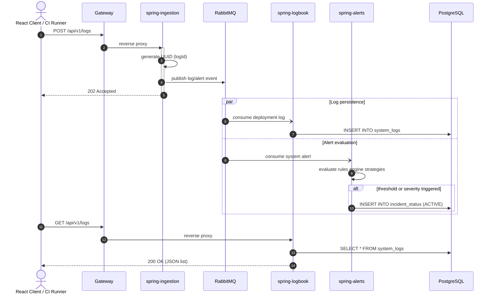
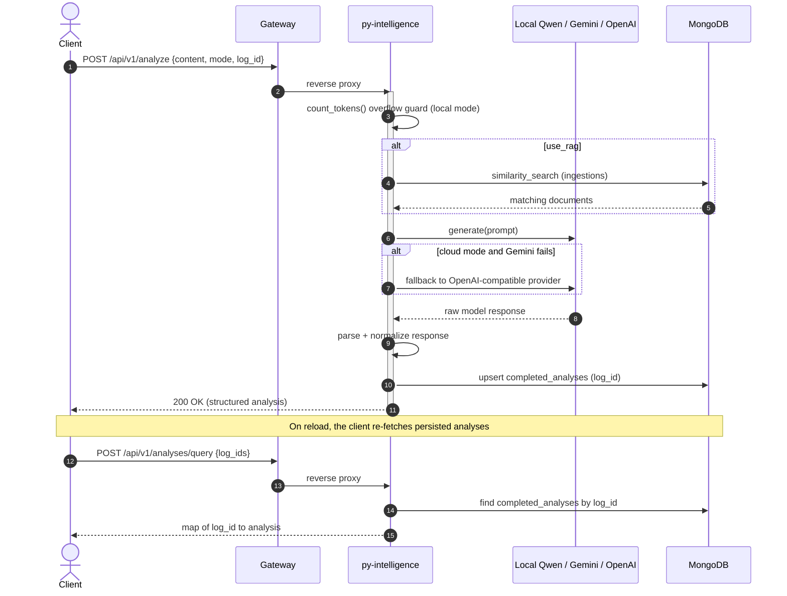

# Communication Flow

## Log Ingestion

```mermaid
sequenceDiagram
    autonumber
    actor Client as React Client / CI Runner
    participant Gateway
    participant Ingestion as spring-ingestion
    participant RMQ as RabbitMQ
    participant Logbook as spring-logbook
    participant Alerts as spring-alerts
    participant PG as PostgreSQL

    Client->>Gateway: POST /api/v1/logs
    Gateway->>Ingestion: reverse proxy
    activate Ingestion
    Ingestion->>Ingestion: generate UUID (logId)
    Ingestion->>RMQ: publish log/alert event
    Ingestion-->>Client: 202 Accepted
    deactivate Ingestion

    par Log persistence
        RMQ-)Logbook: consume deployment log
        Logbook->>PG: INSERT INTO system_logs
    and Alert evaluation
        RMQ-)Alerts: consume system alert
        Alerts->>Alerts: evaluate rules engine strategies
        alt threshold or severity triggered
            Alerts->>PG: INSERT INTO incident_status (ACTIVE)
        end
    end

    Client->>Gateway: GET /api/v1/logs
    Gateway->>Logbook: reverse proxy
    Logbook->>PG: SELECT * FROM system_logs
    Logbook-->>Client: 200 OK (JSON list)
```

## AI Analysis

```mermaid
sequenceDiagram
    autonumber
    actor Client
    participant Gateway
    participant PyIntel as py-intelligence
    participant LLM as Local Qwen / Gemini / OpenAI
    participant Mongo as MongoDB

    Client->>Gateway: POST /api/v1/analyze {content, mode, log_id}
    Gateway->>PyIntel: reverse proxy
    activate PyIntel
    PyIntel->>PyIntel: count_tokens() overflow guard (local mode)
    alt use_rag
        PyIntel->>Mongo: similarity_search (ingestions)
        Mongo-->>PyIntel: matching documents
    end
    PyIntel->>LLM: generate(prompt)
    alt cloud mode and Gemini fails
        PyIntel->>LLM: fallback to OpenAI-compatible provider
    end
    LLM-->>PyIntel: raw model response
    PyIntel->>PyIntel: parse + normalize response
    PyIntel->>Mongo: upsert completed_analyses (log_id)
    PyIntel-->>Client: 200 OK (structured analysis)
    deactivate PyIntel

    Note over Client,Mongo: On reload, the client re-fetches persisted analyses
    Client->>Gateway: POST /api/v1/analyses/query {log_ids}
    Gateway->>PyIntel: reverse proxy
    PyIntel->>Mongo: find completed_analyses by log_id
    PyIntel-->>Client: map of log_id to analysis
```
