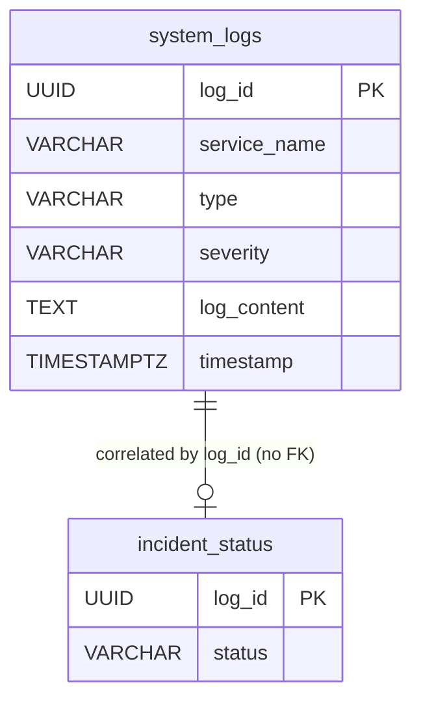
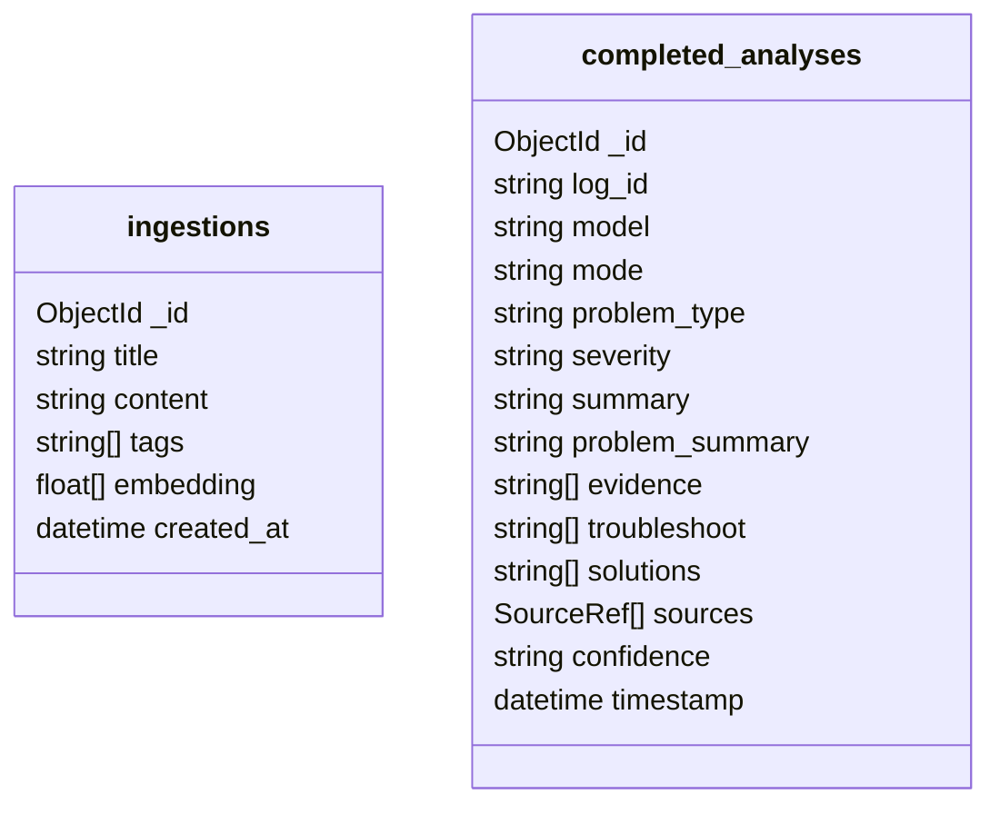

# Database Schema

DevPulse uses two datastores: a shared **PostgreSQL** database (`appdb`) for the Spring services, and **MongoDB** for `py-intelligence`'s RAG documents and persisted AI analyses.

## PostgreSQL

Following microservice principles, the Spring services share a physical database instance for local ease of use, but manage their own independent tables — no foreign keys across services. Correlation is done via the `logId` (UUID) generated at ingestion.

### Table: `system_logs`

**Owning service:** `spring-logbook` — stores immutable, historical records of all ingested system events, deployment logs, and errors.

| Column | Type | Constraints | Description |
| :--- | :--- | :--- | :--- |
| `log_id` | `UUID` | **PK** | Correlation ID generated by `spring-ingestion`. |
| `service_name` | `VARCHAR(255)` | `NOT NULL` | Name of the microservice/system that emitted the log. |
| `type` | `VARCHAR(255)` | `NOT NULL` | Log category (e.g. `DEPLOYMENT_LOG`, `SYSTEM_ALERT`). |
| `severity` | `VARCHAR(255)` | `NOT NULL` | Severity level (`INFO`, `WARN`, `ERROR`, ...). |
| `log_content` | `TEXT` | nullable | The message, stack trace, or payload. |
| `timestamp` | `TIMESTAMPTZ` | `NOT NULL` | UTC timestamp when the event occurred. |

### Table: `incident_status`

**Owning service:** `spring-alerts` — tracks the lifecycle state of incidents flagged by the rules engine.

| Column | Type | Constraints | Description |
| :--- | :--- | :--- | :--- |
| `log_id` | `UUID` | **PK** | Same correlation ID as the triggering log. |
| `status` | `VARCHAR(50)` | `NOT NULL`, default `ACTIVE` | `ACTIVE`, `RESOLVED`, `IN_PROGRESS`, or `IGNORED`. |

Decoupling over foreign keys is intentional: `spring-alerts` and `spring-logbook` process messages asynchronously via RabbitMQ and never depend on each other's transactions.

## MongoDB

`py-intelligence` connects to a MongoDB Atlas cluster (`MONGODB_URI`) and uses two collections in the `rag` database. Being document-based, there's no fixed schema or foreign keys — the shapes below reflect what the application code actually reads/writes.

### Collection: `ingestions`

RAG knowledge base. Each document is a runbook/fix note, embedded via SentenceTransformers for similarity search (`similarity_search` in `embedding_utils.py`).

| Field | Type | Notes |
| :--- | :--- | :--- |
| `_id` | `ObjectId` | Mongo default primary key. |
| `title` | `string` | Required. |
| `content` | `string` | Required. |
| `tags` | `string[]` | Defaults to `[]`. |
| `embedding` | `float[]` | Added asynchronously once generated; absent until then. |
| `created_at` | `datetime` | Set on insert if not provided. |

### Collection: `completed_analyses`

Persisted AI analysis results, so a re-opened log shows its previous analysis instead of an empty panel.

| Field | Type | Notes |
| :--- | :--- | :--- |
| `_id` | `ObjectId` | Mongo default primary key. |
| `log_id` | `string` | Present when the analysis is tied to a specific log; upserted on. |
| `model` | `string` | Which model actually produced the result (local Qwen, Gemini, or the OpenAI fallback). |
| `mode` | `string` | Requested mode: `local` or `cloud`. |
| `problem_type`, `severity`, `summary`, `problem_summary`, `confidence` | `string` | Structured analysis fields. |
| `evidence`, `troubleshoot`, `solutions` | `string[]` | Structured analysis fields. |
| `sources` | `object[]` | RAG references, `{id, title}`. |
| `timestamp` | `datetime` | Set on insert/update. |
