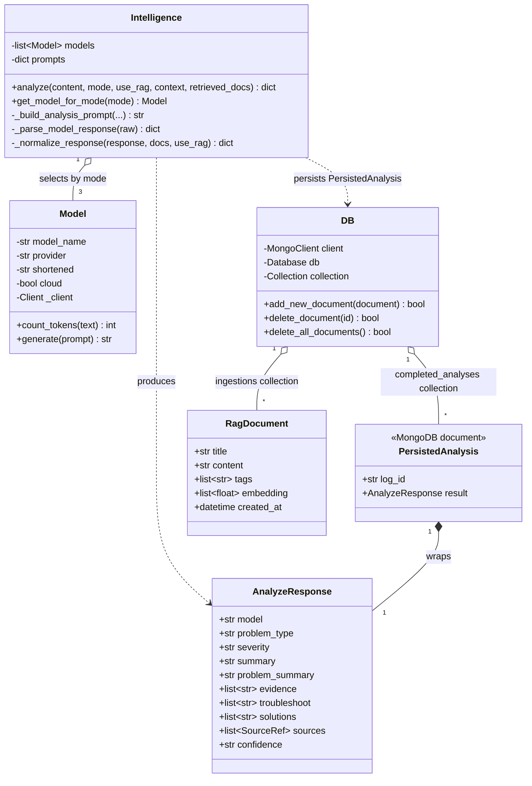

# Analysis Object Model

Core domain entities and relationships, one diagram per backend service. The three Spring services were modeled with a UML tool; `py-intelligence` is expressed as Mermaid since it's generated directly from the current code.

## spring-logbook

Owns the `system_logs` table: consumes ingestion events off RabbitMQ, persists them, and serves the deployment history timeline.

## spring-alerts

Owns the `incident_status` table. Uses a Strategy pattern (`AlertStrategy` implementations like `MetricThresholdStrategy`) so new alert conditions can be added without touching the core rules engine.

## spring-ingestion

The synchronous entry point: validates incoming payloads, assigns the correlation `logId`, and publishes to RabbitMQ. Holds no persistent state of its own.

## py-intelligence

The GenAI service. `Intelligence` orchestrates prompt building, model selection, and response parsing; `Model` wraps each LLM backend (local Qwen via llama.cpp, Gemini, OpenAI-compatible fallback); `DB` wraps MongoDB access for both RAG documents and persisted analyses.

