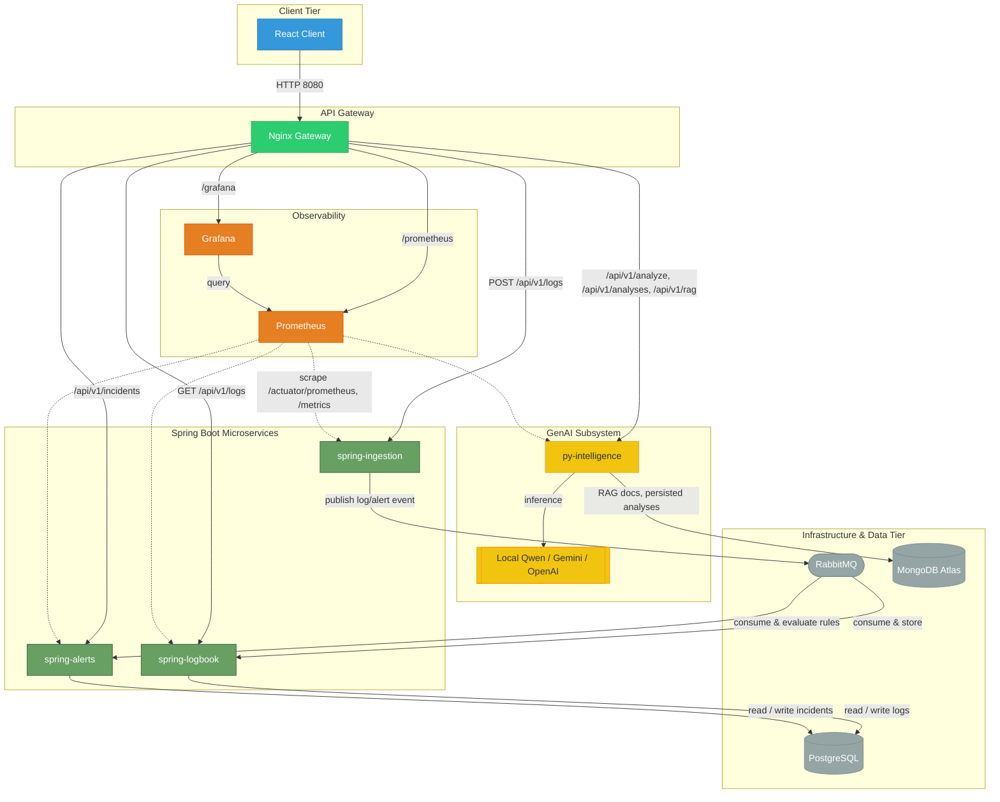

# System Design (Subsystem Decomposition)

## Component Responsibilities

- **Client** — React dashboard. Talks only to the gateway, never directly to a backend service.
- **Gateway** — single entry point, routes by path/method, terminates TLS on the cluster, gates `/prometheus` behind basic auth.
- **spring-ingestion** — synchronous front door. Validates payloads, assigns a `logId`, publishes to RabbitMQ, returns `202` immediately.
- **spring-logbook** — system of record for the log timeline. Consumes off RabbitMQ, persists to Postgres, serves read endpoints.
- **spring-alerts** — rules engine (Strategy pattern) evaluating incoming events for anomalies, tracks incident lifecycle in Postgres.
- **py-intelligence** — GenAI service. Selects a model by requested mode (local/cloud), builds the prompt, parses the response, persists it to MongoDB, and exposes RAG document management.
- **PostgreSQL** — relational store shared by the two Spring services that need it, one table each, no foreign keys across services (see [Database Schema](./database-schema)).
- **MongoDB Atlas** — document store for py-intelligence: RAG documents and persisted AI analyses.
- **RabbitMQ** — decouples ingestion from the services that react to events.
- **Prometheus/Grafana** — scrape each service's own `/actuator/prometheus` or `/metrics` endpoint; no cluster-level metrics (cAdvisor/kube-state-metrics aren't available on the shared student cluster).
