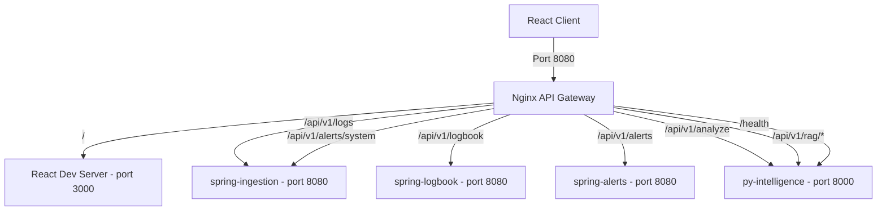

# 🌐 API Gateway Documentation

In DevPulse, an **Nginx-based API Gateway** acts as the single entry point (reverse proxy) for all client requests, routing traffic to the correct microservice based on the URL path. 

This document describes the routing topology, service mappings, and local testing procedures.

---

## 🗺️ Routing Architecture



---

## 📊 Gateway Route Mappings

All client requests should be directed to the gateway at **`http://localhost:8080`**. Nginx processes the requests and routes them internally:

| Path Pattern | Internal Service URL | Description |
| :--- | :--- | :--- |
| **`/`** *(and static assets)* | `http://client:3000` | Fronts the React/Vite development server (proxies WebSockets for HMR). |
| **`/api/v1/logs`** | `http://spring-ingestion:8080` | Endpoint to ingest raw developer/CI logs. |
| **`/api/v1/alerts/system`** | `http://spring-ingestion:8080` | Endpoint to ingest system and monitoring alerts. |
| **`/api/v1/logbook`** | `http://spring-logbook:8080` | Endpoint to retrieve log records and developer notes. |
| **`/api/v1/alerts`** | `http://spring-alerts:8080` | Endpoint to fetch incident lists and state (excluding `/system`). |
| **`/api/v1/analyze`** | `http://py-intelligence:8000` | Coordinates LLM summaries and troubleshooting guides. |
| **`/api/v1/rag/**`** | `http://py-intelligence:8000` | Manages RAG document indexing and semantic retrieval. |
| **`/health`** | `http://py-intelligence:8000` | AI service liveness and health endpoint. |

---

## 🧪 Local Testing

Start the complete stack via Docker Compose:
```bash
cd infra
docker-compose up -d --build
```

### 1. Test Ingestion Service Routing
Post a dummy log event payload to the gateway:
```bash
curl -X POST http://localhost:8080/api/v1/logs \
     -H "Content-Type: application/json" \
     -d '{
           "serviceName": "payment-service",
           "type": "DEPLOYMENT_LOG",
           "severity": "ERROR",
           "logContent": "Out of memory error in payment processor",
           "timestamp": "2026-06-09T16:00:00Z"
         }'
```
* **Expected Result:** HTTP status code `202 Accepted` returned from `spring-ingestion`.

### 2. Test Intelligence Service Routing
Trigger log analysis via the gateway:
```bash
curl -X POST http://localhost:8080/api/v1/analyze \
     -H "Content-Type: application/json" \
     -d '{
           "content": "Deployment failed: database connection timeout",
           "mode": "local",
           "use_rag": false
         }'
```
* **Expected Result:** HTTP status code `200 OK` with structured JSON analysis of the database connectivity issue.
