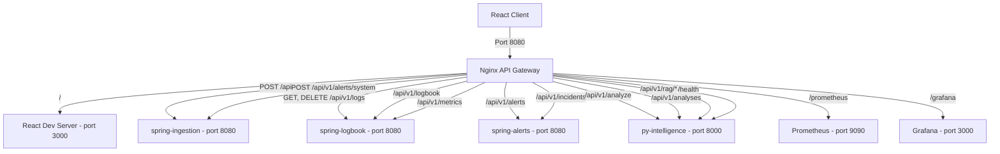

# 🌐 API Gateway Documentation

In DevPulse, an **Nginx-based API Gateway** acts as the single entry point (reverse proxy) for all client requests, routing traffic to the correct microservice based on the URL path and HTTP method. 

This document describes the routing topology, service mappings, and local testing procedures.

---

## 🗺️ Routing Architecture



---

## 📊 Gateway Route Mappings

All client requests should be directed to the gateway at **`http://localhost:8080`**. Nginx processes the requests and routes them internally:

| Path Pattern | HTTP Method | Internal Service URL | Description |
| :--- | :--- | :--- | :--- |
| **`/`** *(and static assets)* | `ALL` | `http://client:3000` | Fronts the React/Vite development server (proxies WebSockets for HMR). |
| **`/api/v1/logs`** | `POST` | `http://spring-ingestion:8080` | Endpoint to ingest raw developer/CI logs. |
| **`/api/v1/logs`** | `GET`, `DELETE` | `http://spring-logbook:8080` | Endpoint to retrieve or delete log records and deployment history. |
| **`/api/v1/alerts/system`** | `POST` | `http://spring-ingestion:8080` | Endpoint to ingest system-level alerts. |
| **`/api/v1/logbook`** | `ALL` | `http://spring-logbook:8080` | Logbook-specific endpoints. |
| **`/api/v1/alerts`** | `ALL` | `http://spring-alerts:8080` | Alert management endpoints. |
| **`/api/v1/incidents`** | `GET`, `PATCH` | `http://spring-alerts:8080` | Endpoint to fetch incident lists and update status states. |
| **`/api/v1/metrics`** | `ALL` | `http://spring-logbook:8080` | Application-level metrics endpoints (log statistics). |
| **`/api/v1/analyze`** | `POST` | `http://py-intelligence:8000` | Coordinates LLM summaries and troubleshooting guides. Extended timeout (180s) for model inference. |
| **`/api/v1/analyses`** | `ALL` | `http://py-intelligence:8000` | CRUD for persisted analysis results. |
| **`/api/v1/rag/**`** | `ALL` | `http://py-intelligence:8000` | Manages RAG document indexing and semantic retrieval. Extended timeout (180s). |
| **`/health`** | `GET` | `http://py-intelligence:8000` | AI service liveness and health endpoint. |
| **`/prometheus`** | `ALL` | `http://prometheus:9090` | Prometheus UI. Protected by HTTP basic auth (credentials from env vars). |
| **`/grafana`** | `ALL` | `http://grafana:3000` | Grafana dashboards and alerting UI. |

---

## 🧪 Local Testing

Start the complete stack via Docker Compose:
```bash
cd infra
docker-compose up -d --build
```

### 1. Test Ingestion Service Routing (POST Logs)
Post a dummy log event payload to the gateway:
```bash
curl -X POST http://localhost:8080/api/v1/logs \
     -H "Content-Type: application/json" \
     -d '{
           "serviceName": "payment-service",
           "type": "DEPLOYMENT_LOG",
           "severity": "ERROR",
           "logContent": "Out of memory error in payment processor",
           "timestamp": "2026-06-09T16:00:00Z"
         }'
```
* **Expected Result:** HTTP status code `202 Accepted` returned from `spring-ingestion`.

### 2. Test Logbook Service Routing (GET Logs)
Fetch the deployment history timeline:
```bash
curl -X GET http://localhost:8080/api/v1/logs
```
* **Expected Result:** HTTP status code `200 OK` returning a JSON list of historical deployment logs from `spring-logbook`.

### 3. Test Alerts Service Routing (GET Incidents)
Fetch the current incident statuses:
```bash
curl -X GET "http://localhost:8080/api/v1/incidents?status=ACTIVE"
```
* **Expected Result:** HTTP status code `200 OK` returning a JSON list of active incidents from `spring-alerts`.

### 4. Test Intelligence Service Routing
Trigger log analysis via the gateway:
```bash
curl -X POST http://localhost:8080/api/v1/analyze \
     -H "Content-Type: application/json" \
     -d '{
           "content": "Deployment failed: database connection timeout",
           "mode": "local",
           "use_rag": false
         }'
```
* **Expected Result:** HTTP status code `200 OK` with structured JSON analysis of the database connectivity issue.

### 5. Test Monitoring Routing
Access Prometheus (basic auth required — credentials are set via `PROMETHEUS_AUTH_USER` / `PROMETHEUS_AUTH_PASSWORD` in `infra/.env`):
```bash
curl -u "${PROMETHEUS_AUTH_USER}:${PROMETHEUS_AUTH_PASSWORD}" http://localhost:8080/prometheus/-/ready
```
* **Expected Result:** HTTP status code `200 OK` confirming Prometheus is operational.

Access Grafana:
```bash
curl http://localhost:8080/grafana/api/health
```
* **Expected Result:** HTTP status code `200 OK` with JSON health status from Grafana.