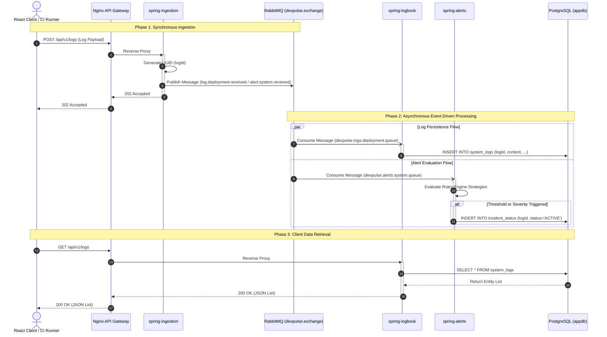

```mermaid
sequenceDiagram
    autonumber
    actor Client as React Client / CI Runner
    participant Gateway as Nginx API Gateway
    participant Ingestion as spring-ingestion
    participant RMQ as RabbitMQ (devpulse.exchange)
    participant Logbook as spring-logbook
    participant Alerts as spring-alerts
    participant DB as PostgreSQL (appdb)

    %% --- Phase 1: Ingestion ---
    Note over Client, RMQ: Phase 1: Synchronous Ingestion
    Client->>Gateway: POST /api/v1/logs (Log Payload)
    Gateway->>Ingestion: Reverse Proxy
    
    activate Ingestion
    Ingestion->>Ingestion: Generate UUID (logId)
    Ingestion->>RMQ: Publish Message (log.deployment.received / alert.system.received)
    Ingestion-->>Gateway: 202 Accepted
    deactivate Ingestion
    
    Gateway-->>Client: 202 Accepted

    %% --- Phase 2: Asynchronous Processing ---
    Note over RMQ, DB: Phase 2: Asynchronous Event Driven Processing
    par Log Persistence Flow
        RMQ-)Logbook: Consume Message (devpulse.logs.deployment.queue)
        activate Logbook
        Logbook->>DB: INSERT INTO system_logs (logId, content, ...)
        deactivate Logbook
    and Alert Evaluation Flow
        RMQ-)Alerts: Consume Message (devpulse.alerts.system.queue)
        activate Alerts
        Alerts->>Alerts: Evaluate Rules Engine Strategies
        alt Threshold or Severity Triggered
            Alerts->>DB: INSERT INTO incident_status (logId, status='ACTIVE')
        end
        deactivate Alerts
    end

    %% --- Phase 3: Client Retrieval ---
    Note over Client, DB: Phase 3: Client Data Retrieval
    Client->>Gateway: GET /api/v1/logs
    Gateway->>Logbook: Reverse Proxy
    activate Logbook
    Logbook->>DB: SELECT * FROM system_logs
    DB-->>Logbook: Return Entity List
    Logbook-->>Gateway: 200 OK (JSON List)
    deactivate Logbook
    Gateway-->>Client: 200 OK (JSON List)
```