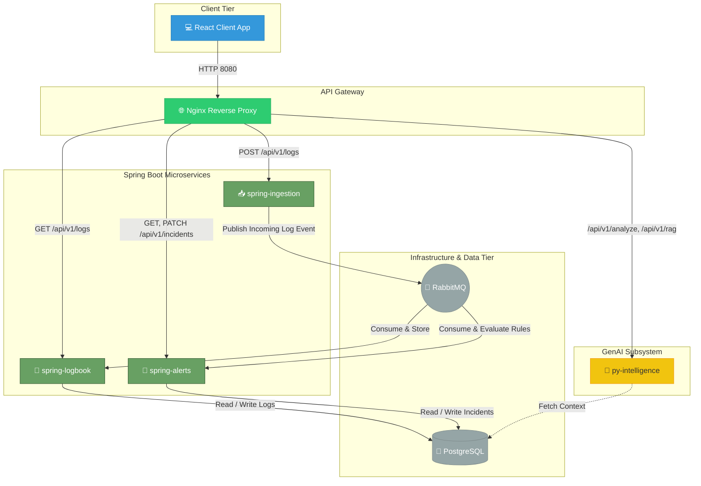

```mermaid
graph TD
    %% Define Styles
    classDef client fill:#3498db,stroke:#2980b9,color:#fff
    classDef gateway fill:#2ecc71,stroke:#27ae60,color:#fff
    classDef spring fill:#68A063,stroke:#3b5f38,color:#fff
    classDef python fill:#f1c40f,stroke:#f39c12,color:#333
    classDef infra fill:#95a5a6,stroke:#7f8c8d,color:#fff

    subgraph "Client Tier"
        UI[💻 React Client App]:::client
    end

    subgraph "API Gateway"
        Nginx[🌐 Nginx Reverse Proxy]:::gateway
    end

    subgraph "Spring Boot Microservices"
        Ingestion[📥 spring-ingestion]:::spring
        Logbook[📖 spring-logbook]:::spring
        Alerts[🚨 spring-alerts]:::spring
    end

    subgraph "GenAI Subsystem"
        PyIntel[🧠 py-intelligence]:::python
    end

    subgraph "Infrastructure & Data Tier"
        RMQ((🐇 RabbitMQ)):::infra
        DB[(🐘 PostgreSQL)]:::infra
    end

    %% External Traffic
    UI -->|HTTP 8080| Nginx

    %% Internal Routing
    Nginx -->|POST /api/v1/logs| Ingestion
    Nginx -->|GET /api/v1/logs| Logbook
    Nginx -->|GET, PATCH /api/v1/incidents| Alerts
    Nginx -->|/api/v1/analyze, /api/v1/rag| PyIntel

    %% Async Messaging
    Ingestion -->|Publish Incoming Log Event| RMQ
    RMQ -->|Consume & Store| Logbook
    RMQ -->|Consume & Evaluate Rules| Alerts

    %% Data Persistence
    Logbook -->|Read / Write Logs| DB
    Alerts -->|Read / Write Incidents| DB

    %% Cross-Service API calls (if any)
    PyIntel -.->|Fetch Context| DB
```