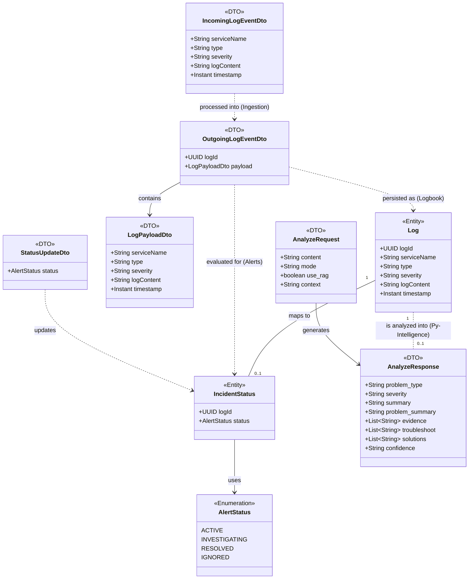

# Unified Analysis Object Model (AOM)

This document provides a unified view of the core domain objects, entities, and data transfer objects (DTOs) used across all DevPulse microservices (`spring-ingestion`, `spring-logbook`, `spring-alerts`, and `py-intelligence`).

### Domain Component Mapping
- **`Log`**: Persisted by `spring-logbook` in PostgreSQL.
- **`IncidentStatus`**: Persisted by `spring-alerts` in PostgreSQL.
- **`AlertStatus`**: Shared enumeration representing the lifecycle of an incident.
- **`EventDto` & `PayloadDto`**: Data models used for asynchronous message brokering over RabbitMQ.
- **`Analyze`**: REST payload models defined in OpenAPI, used for synchronous communication with the `py-intelligence` Python microservice.
